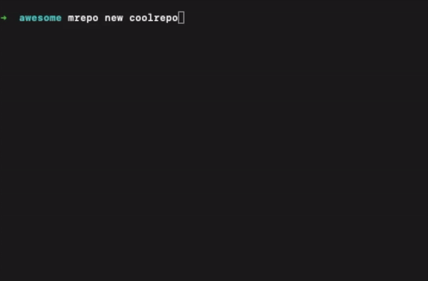

<div align="center">
  <h1>MREPO</h1>
</div>

<div align="center">
  <strong>Awesome TypeScript monorepository swiss knife</strong>
</div>

<br />

<div align="center">
  <a href="https://github.com/zMotivat0r/mrepo/actions/workflows/tests.yml">
      
  </a>
  <a href="https://github.com/zMotivat0r/mrepo/blob/master/LICENSE">
      
  </a>
</div>

<div align="center">
  <sub>Built with :purple_heart: by 
  <a href="https://twitter.com/MichaelYali">@MichaelYali</a>
  <div align="center">
    :star2: :eyes: :zap: :boom:
  </div>
</div>

<br />

Mrepo makes it easy to create new TypeScript packages monorepository, generate new packages, build, test, link/unlink to try them locally, publish either to GitHub or NPM package registry.

## Features



- :rocket: Generate TypeScript monorepository
- :airplane: Package generator with references between other packages included, and sub-generators support
- :vertical_traffic_light: Build, clean, link/unlink, release packages commnads
- :icecream: Jest testing ready (unit, e2e, coverage commands included)
- :lollipop: Lint and format (eslint & prettier)
- :candy: Husky hooks ready (pre-commit hook included)
- :watermelon: Conventional commits and changelogs
- :pineapple: GitHub actions included (tests & release)
- :coffee: Issues and Pull Request templates

## Install

```shell
$ npm i @zmotivat0r/mrepo -g
```

## Commands

- [mrepo new](#mrepo-new)

### `mrepo new`

Generates new TypeScript monorepository.

```shell
mrepo new|n [options] <name>

Arguments:
  name               Monorepo name

Options:
  -y, --yes          Use default options (default: false)
  --dry-run          Dry run (default: false)
  --skip-scripts     Skip post-generator scripts (default: false)
  --skip-git         Skip git init (default: false)
  --skip-git-commit  Skip git initial commit (default: false)
  --skip-install     Skip dependencies installation (default: false)
  -h, --help         display help for command
```

Usage:

```shell
$ mrepo new awesome-monorepo --yes --skip-git
```

## Support

Any support is welcome. At least you can give it a star :star:

## License

[MIT](LICENSE)
